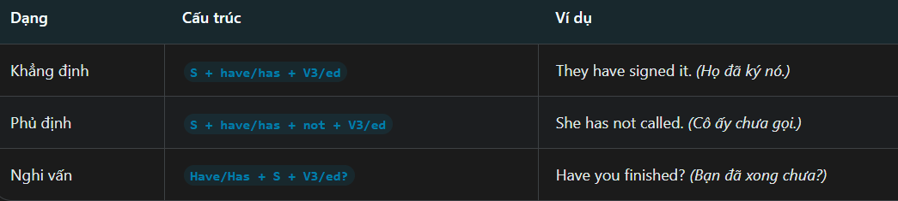
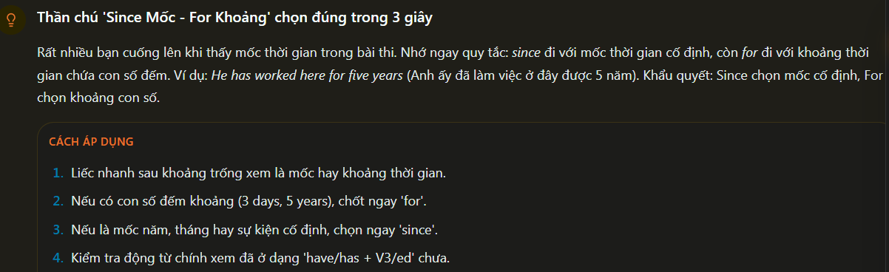
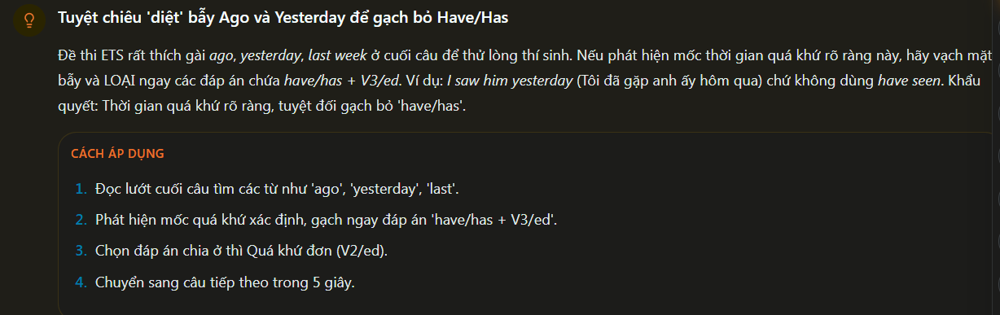
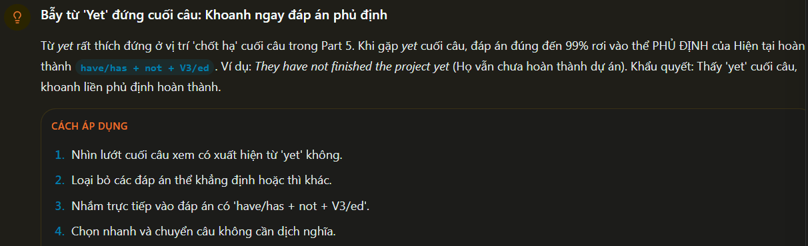
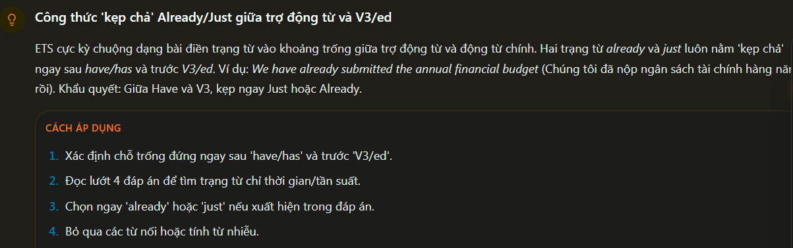
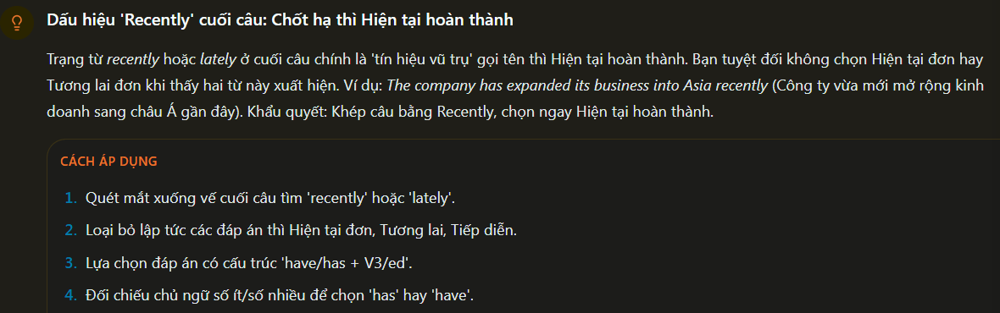
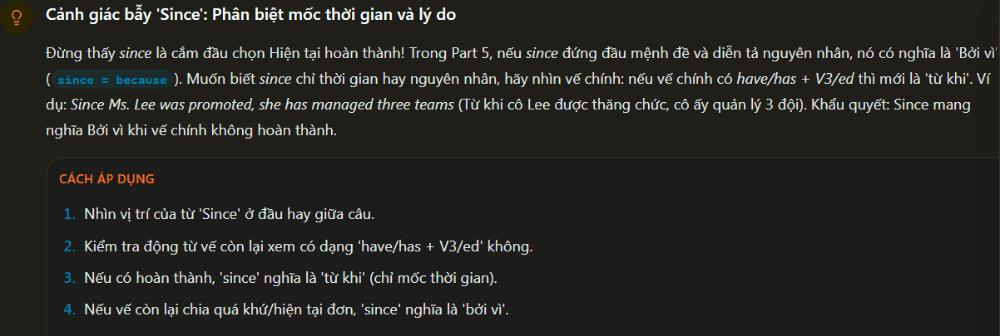
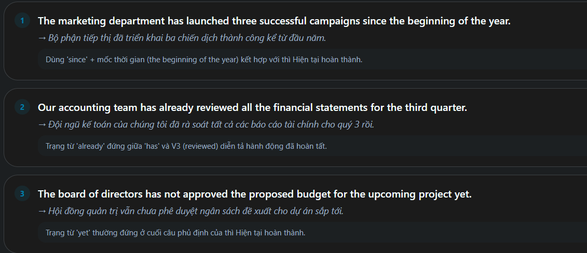
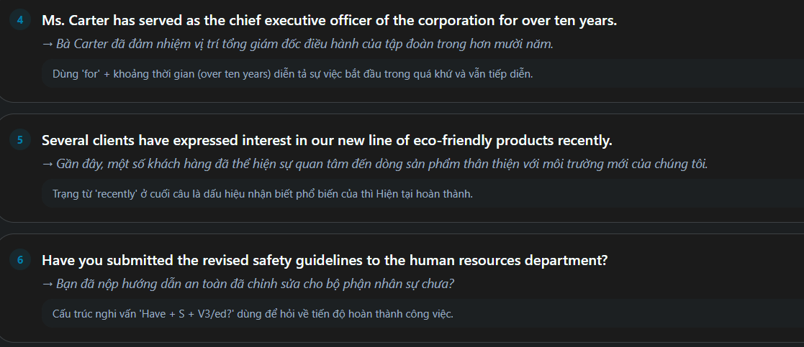

Present-Perfect:
 - Thì hiện tại hoàn thành diễn tả hành động đã xảy ra trong quá khứ nhưng kết quả hoặc ảnh hướng vẫn còn ở hiện tại. Cấu trúc này thường dùng để báo cáo tiến độ, kinh nghiệm hoặc sự việc vừa xảy ra ở công sở.

Present-perfect Fomula:

How to use Present-Perfect:
 - Hành động vừa xong: Diễn tả sự việc vừa xảy ra gần đây Ex: We have just Signed the new contract. ( chúng tôi vừa kí hợp đông mới)
 - kinh nghiệm làm việc: Nói về trải nghiệm tính đến thời điểm hiện tại.  Ex: He has worked here for five Years. ( tôi đã lmaf việc ở đây được 5 năm)
 - Hành động kéo dai: Diễn tả sự việc bắt đầu ở quá khứ và tiếp điễn đến nay.  Ex: They have not finished the project yet. ( Họ vẫn chưa hoàn thành dự án)

Identification sign:
 - Keywork: Since, for, already, yet, recently, lately, ever, just, never.
 - Positions: already, just đứng sau have/has; yet ở cuối câu ; since/for đứng trước mốc hoặc khoảng thời gian

Common errors:
 - Wrong: I have seen him yesterday => Correct: I saw him yesterday (Có mốc thời gian xác định trong quá khứ phai dùng quá khứ đơn.)
 - Wrong: She has worked here since five years => Correct: She has worked here for five years. (Khoảng thời gian dùng for, mốc thời gian dùng since)

Tip/Trick:
 - Look: Recently/lately đứng cuối câu => chọn have/has + V3/ed
 - Look: Yet nằm ở cuối câu => chọn dạng phủ định have/has + not + V3/ed.

'since Mốc - For khoảng'

Bẫy 'ago' và 'Yesterday' để gạch bảo have/has

Bẫy 'yet' đứng cuối câu: khoanh ngay đáp án phủ định

alreday/just giữa trợ động từ và v3/ed

'Recently' cuối câu: Chốt hạ thì hiện tại hoàn thành

'Since': phân biệt mốc thời gian và lý do

EXAMPLE:

