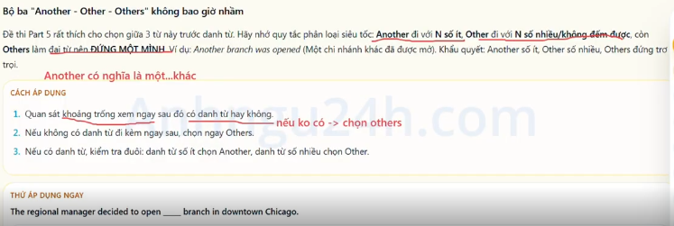
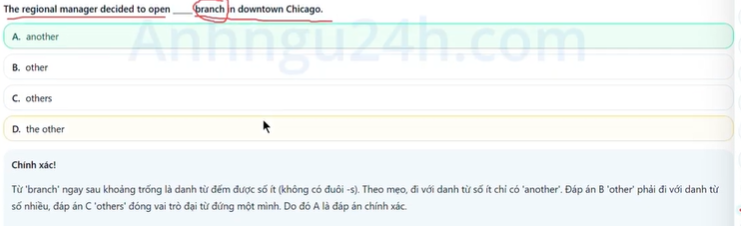
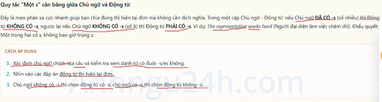
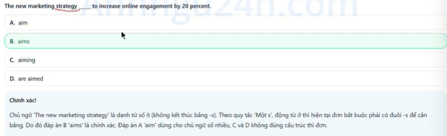
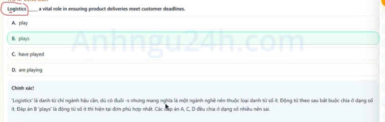
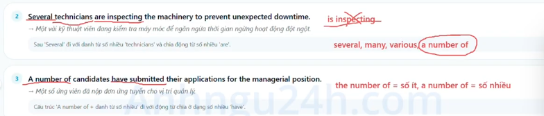

Definition: Singular and Plural Nouns

1. Singular Noun ( danh từ số ít)
A singular noun refers to one person, one place, one thing, or one idea. behind a/an/one/every

Ex:
    - one student
    - a company 
    - an employee
    - one book
structure:
    a/an + N 
EX: A manager called.

2. Plural Noun ( danh từ số nhiều)
A plural noun refers to two or more people, place, thing, or ideas. Behind many,several,few

Ex:
    - two students
    - several companies
    - many employees
    - three books
structure:
    N + s/es 
EX: Two clients arrived.

3. Irregular noun forms
A Noun changes its vowel (nguyên âm) or keep the same vowel when forming the plural

Structure:
    N( đặc biệt)
EX: three men left.

Common mistakes:

    - worng: every employees must attend => correct: Every employee must attend (after every must use singular Noun (bắt buộc dùng danh từ số ít đếm được))
    - Worng: Many information were updated => correct: Much information was updated (information is uncoutable Noun, use much and singular verbs )

TIP/TRICK Toiec

    - Look: if you see a quantity work before the blank, check whether the work immediately after it is singular or plural

    - Look: each,every,another => singular Noun (danh từ số ít)
    - Look: several,various,a number of => Plural Noun (danh từ số nhiều)

Remove the -s or -es after "every" and "each"
    - EX: Every employee is required  to submit the completed tine sheet by friday afternoon

Differant "A number of" and "The number of" in 3 seconds
 A number of mean "Many" should be followed by plural Noun
 The number of mean "Number" should be followed singular Noun
    - Ex: A number of security proceduces were updated during the recent compliance audit.

the -ia noun trap
 this is an irregular plural forn of latin. 
 ex: critieria, phenomena, media, data => plural Noun even though it does not haven an -s
    - EX: All the selection criteria are clearly explain in the employee handbook

A trio of nouns "Another - other - others"
 Another is followed by singular nouns 
 Other is followed by plural nouns
 Others is A pronoun that stand alone

    - EX:
    

Rule "one -s" subject-verbs agreement
 IF subject has -s (plural),the verbs does not have -s,Conversely,if the subject does not have -s, then the verb must have -s 
 
    EX:
    

The -ics Noun trap: it look plural but is actually singular
 Words ending in -ics maybe logistics,economicm,statistics look like plural nouns because it end in -s. However, name of academic subject or fields of study are actually singular nouns

    - EX:
    

Keywords:
inspecting: đang kiểm tra
Prevent: ngăn ngừa
candidates: ứng viên
Submitted: đã nôp đơn
criteria: các tiêu chí (criterion: một tiêu chí)
committee: uỷ ban/ hội đồng
Established: thiết lập
Deparments: phòng ban
Collabrated: hợp tác
Onboarding process: quy trình tiếp nhận
Representatives: đại điện
proposals: các đề xuất
Participations: những người tham gia
performance criteria: các tiêu chí đánh giá hiệu suất
