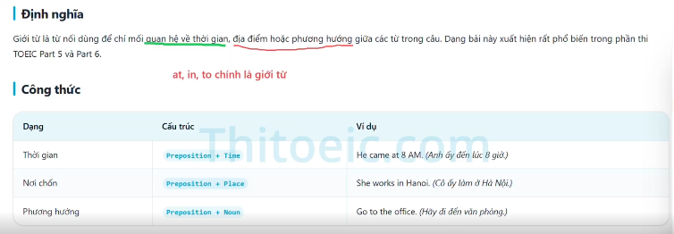
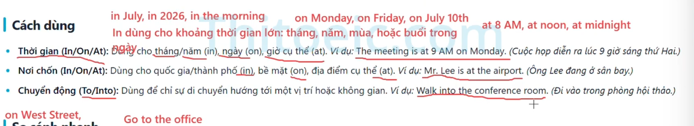
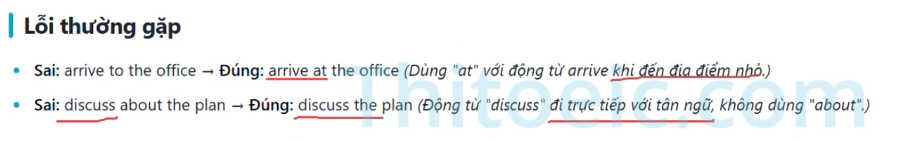
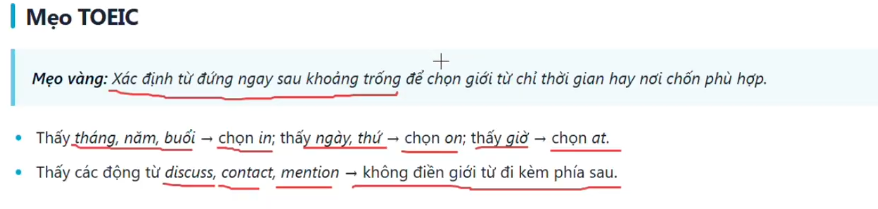
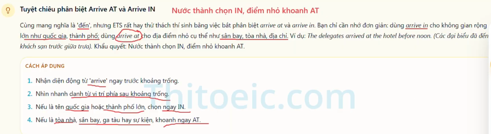
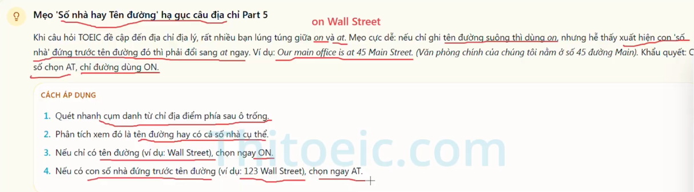
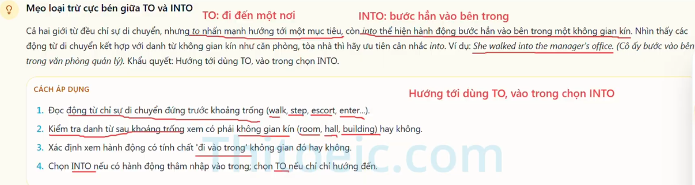

Definition: Preposition
 A preposition is a connecting word that shows a relationship of time, place, or direction between words in a sentence.

Structure:
    Time(thời gian): preposition + time
        EX:He came at 8 AM
Hint: Time(in/on/at): use (in) for months and year,(on) for day,(at) for specific time (giờ cụ thể)

    Place(nơi chốn): preposition + Place
        EX: She works in Hanoi
Hint: Place(in/on/at): use (in) for country and city,(on) for surface, (at) for specific place

    Noun(phương hướng): preposition + Noun
        EX: Go to the office
Hint: Movement(to/into): use to indicate movement toward a place or space

Wrong common:
 - Wrong: Arrive to the office => correct: Arrive at the office
 - Wrong: discuss about the plan => correct: Discuss the plan

Tip/Trick:

    - Look month, year, session => choose in; day or week => choose on, Time => choose at
    - look verbs (Discus,contact,mention) => Do not put a preposition after it

 Example preposition common:

 

Vocabulary:

- Specific: cụ thể
- Surface: bề mặt
- Preposition: giới từ
- sentence: câu
- space: không gian
- Indicate: chỉ ra/ biểu hiện
- Discuss: thảo luận/ bàn luận
- Mention: đề cập/ nhắc đến
- Strategy: chiến lươcj
- headquarters: trụ sở chính
- facility: cơ sở,lưu trú
- presentation