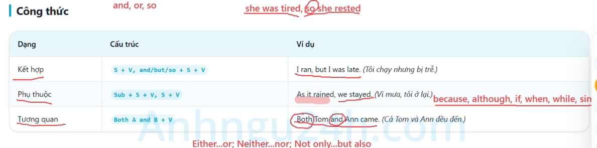
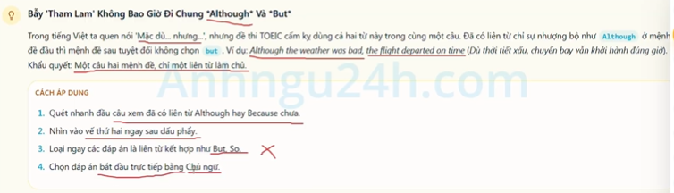
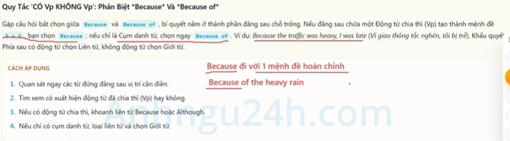
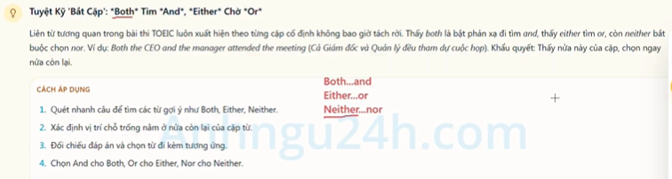
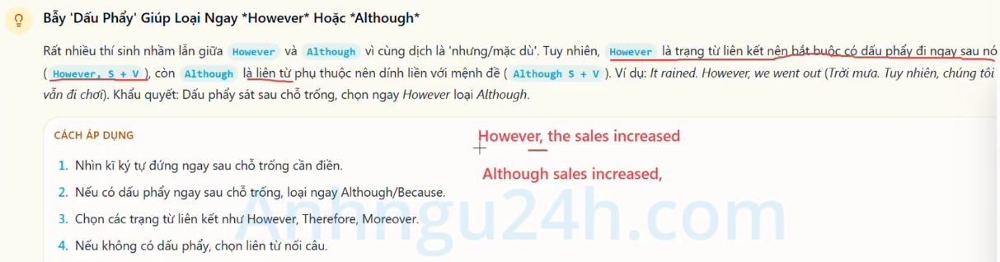
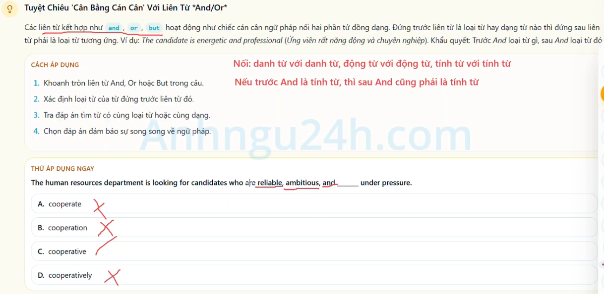
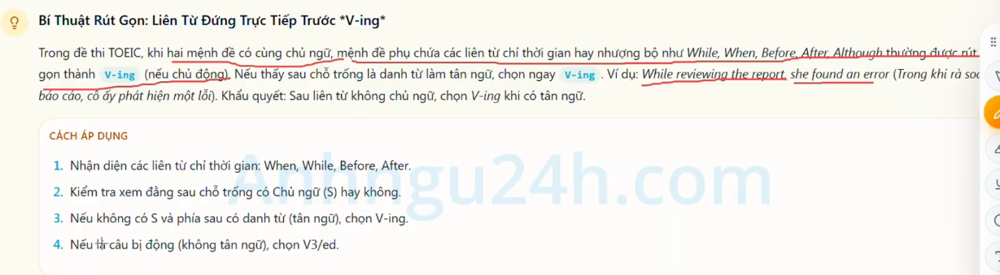
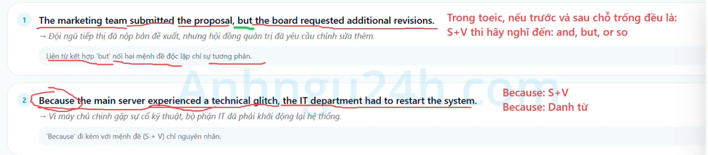
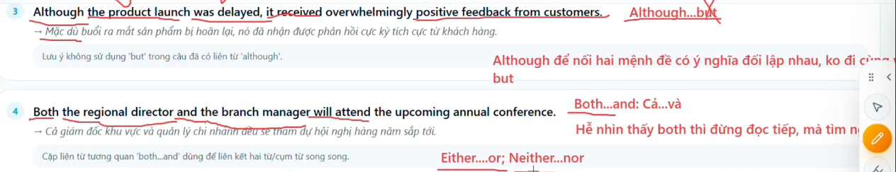
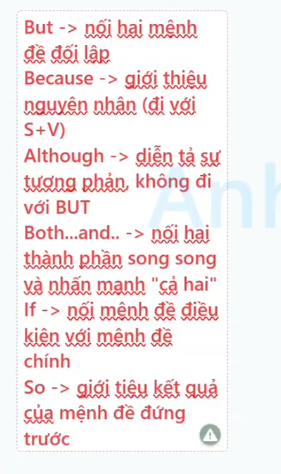

Definition: basic-conjuctions
A conjuctions is a word used to connect words, phrases, or clauses in a sentence

    Fomula:

Identifying signs:
 - keywords: and, but, or, because, althouh, if, both...and, either...or
 - position: it can stand between two words or phrases, or at the  beginning or between two clauses

Wrong common:
 - Wrong: Athough he was tire, but he finished the word => correct:  Although he wass tired, he finished the word.   (do not use although and but in same sentenses)
 - Wrong: because of the weather, we stayed home => correct: Because the weather was bad, we stayed home.
---

Tip/trick

1. The "greedy" trap: never use "although" and "but" together

2. Rule "have vp no vp": Distinguish "because" and "because of"

3. Secret technique pair "Both" search "and", "Either" wait "or"

4. trap "comma" eliminate immediately "however" or "although"

5. Skil "balance the scales" với conjuctions "and/or"

6. shortened: A conjuctions is following directly by V-ing

Example:

vocabulary:
rule: quy luật, luật lệ
Distinguish: phân biệt
Secret technique: tuyệt kỹ
Pair: bắt cặp
Eliminate:loạibỏ  -immediately: giúp loại ngay
