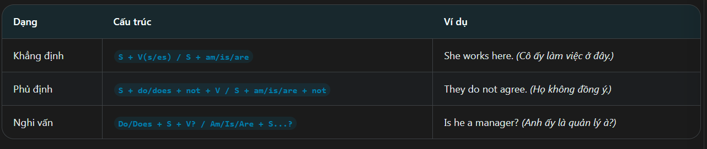

Definition:

The present simple is a tense useb to dercise habit, repeated actions, general facts, permanent situations and regular schedules
Thì hiện tại đơn được dùng để diễn tả thói quen, hành động lặp lại, sự thật hiển nhiên, tình trạng ổn định và lịch trình cố định

Present-simple_Fomula:

Use of the Present-Simple:
 - Habits and repeated actions: diễn tả thói quen lặp lại thường xuyên => EX: He checks email every morning
 - General facts and truths: sự thật khách quan => EX: The contract contains three pages
 - schedules and timetables: diễn tả thời gian biểu, lịch trình tàu xe => EX: The Flyght depart at 9 AM 

Identification Signs(dấu hiệu nhận biết)
 - Keywords: always, usually, often, sometimes, everyday, weekly, monthly, annually
 - positions: trạng từ chỉ tần suất đứng trước động từ thường, đứng sau động từ to be
EX:
 - The Ceo attends the board meeting every months
 - Our company provides high-quality sofware solutions
 - Ms. Green manages the human resouces department

Wrong common:
 - Wrong: He work at the marketing team => Correct: He works at the marketing team
 - Wrong: she doesn't likes the new policy => she doesn't like the new policy

TIP/TRICK:
 - Look everyday, annually -> chọn động từ chia hiện tại đơn (V-s/es)
 - thấy chủ ngử là danh từ số it/ không đêm được => thêm s/es vào động từ thường.