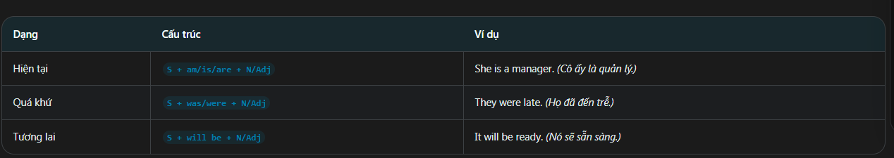
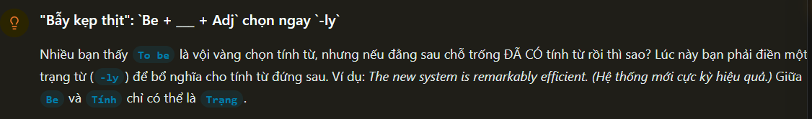
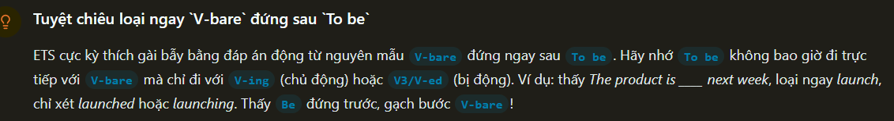
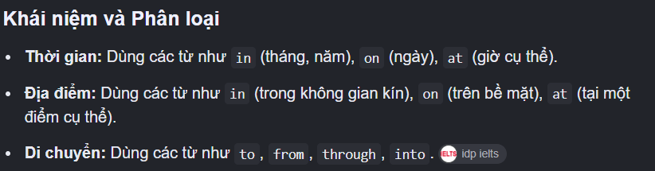
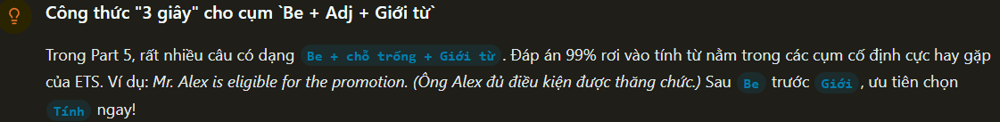
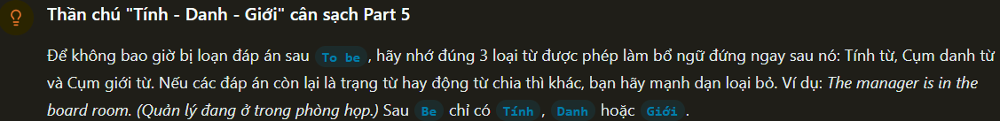
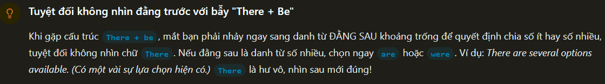
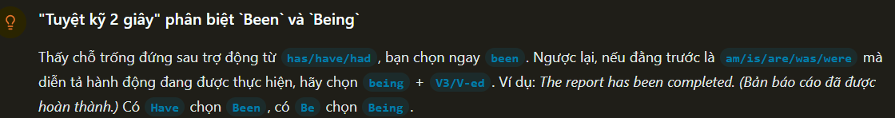
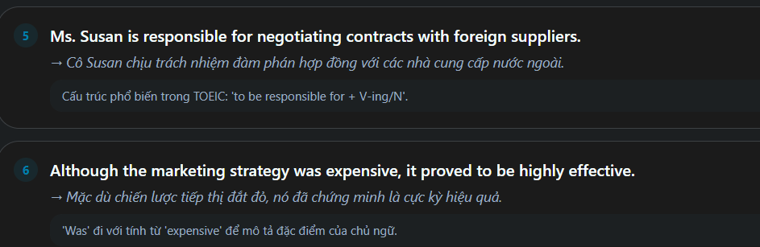

Definition: "to be"
động từ "to be" (am/is/are/was/were) có nghĩa là "thì,là,ở". Nó dùng để diên tả trạng thái,đặc điểm hoặc vị trí chủ ngử

Fomula:

How to use:
 - be + adjactive: Mô tả tính chất hoặc trạng thái chủ ngử
 - Be + Noun: giới thiệu danh tính, nghề nghiệp và chức danh
 - Be + Prepositional phrase: chỉ vị trí hoặc thời gian của sự việc

Common preposition:
 - keywork: am,is,are,was,were,been,being
 - Position: đưng sau chủ ngử và đứng trước danh từ, tính tù  hoặc cụm giới từ

Wrong Common:
 - Wrong: she is work very hard => Correct: she works very hard (Không dùng "Be" trực tiếp động từ nguyên mẫu)
 - Wrong: The CEO is Strongly => Correct: The CEO is strong (sau "to be" dùng tính từ, không dùng trạng từ)

Tip/Trick:
 - Look avoid + Adjactive => choose "to be"
 - Look To be + Avoid + Adverbs => chọn tính từ sở hữu hoặc mạo từ

Example:
 - 1.'Bẫy kẹp thịt': Be +__+Adj chọn ngay "-ly"
 

 - 2.'Tuyệt chiêu loại ngay V-bare' đứng sau 'To Be'
 

 - 3.Công thức "3 second" chọn cụm từ "be + adj + giới từ" 
 Giới từ:
 

 

 - 4.Thần chú "Tính -Danh -Giới" cân sạch Part 5
 

 -5.Tuyệt đối không nhìn đằng trước vối bẫy "There + Be"
 

 -6.Tuyệt kỉ 2 giây phân biệt "been" và "Being"
 

 
 

Vocabulary:

 -Reliable: đáng tin cậy
 -Accurate: chính xác
 -Complex: Phức tạp
 -Complely: hoàn toàn
