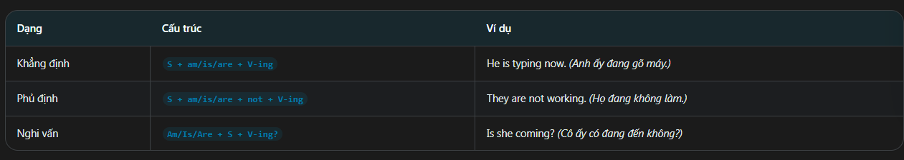
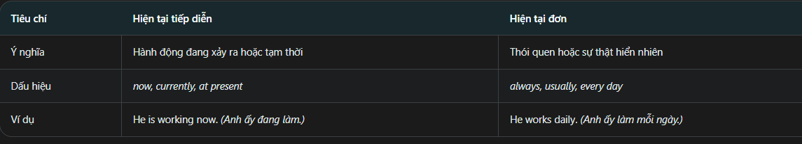
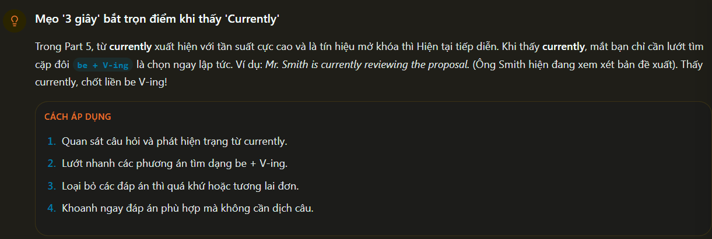
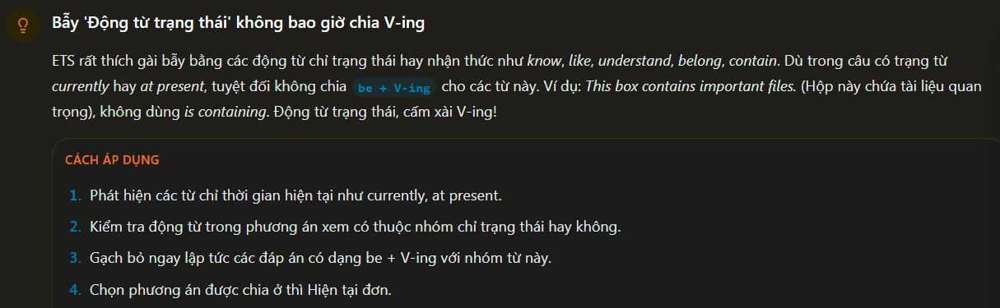
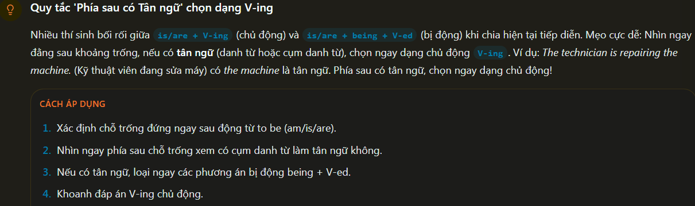
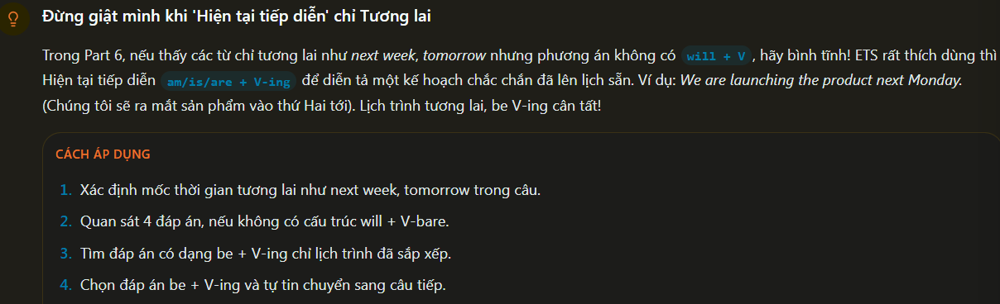
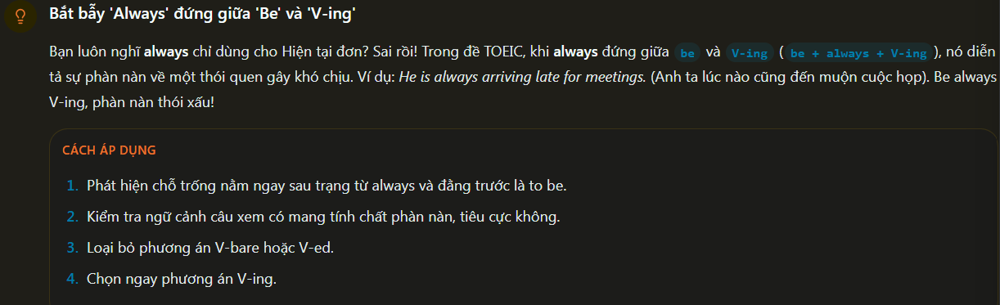

Present Continous: Hiện tai tiếp diễn
Definition:
 - Thì hiện tại tiếp diễn dùng đễ diễn tả hành động đang diễn ra ngay tại thời điểm nói hoặc xung quanh thời điểm nói. Thì này cũng mô tả một kế hoạch đã lên kế hoạch đã lên lịch sẳn trong tương lai gần

Fomula:

How to use:
 - Hành động đang diễn ra: diễn tả việc đang xảy ra tại thời điểm nói
 - kế hoạch tương lai: Diễn tả một lịch trình đã lên kế hoạch sẳn
 - Tình huống tạm thời: Diễn tả sự việc điễn ra trong một thời gian ngắn

 So sánh nhanh:
 

Identification Sign:
 - Keywork: now, right now, currently, at present, Look!
 - Positions: đứng sau động từ to be(am/is/are) hoặc sau các từ cẩm thảm gây chú ý

Common errors:
 - Wrong: she is Knowing the answer => correct: She knows the answer. (Động từ trạng thái không dùng tiếp diễn)
 - Wrong: They are dicuss the plan => correct: They are discussing the plan. (sau to be phải dùng V-ing cho thì tiếp diễn)

Tip/Trick:
 - Thấy Currently => chọn be + V-ing  (để chỉ hành động đang diễn ra)
 - Thấy Look! Hoặc Listen! => chọn Be + V-ing cho động từ theo sau.

 -  Mẹo '3 giây' bắt trọn điểm khi thấy 'Currently'
 

 - Bẫy "động từ trạng thái" không bao giờ chia v-ing
 

 - Quy tắc "Phía sau có tân ngử" chọn dạng V-ing
 

 - Đừng giật mình khi "Hiện tại tiếp diễn" chỉ tương lai
 

 - Bắt bẫy 'always' đứng giữa 'be' và 'v-ing'
 

Example:

Vocabulary:
Campaign: chiến dịch