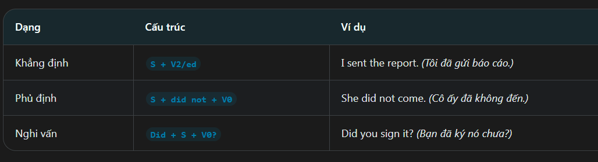
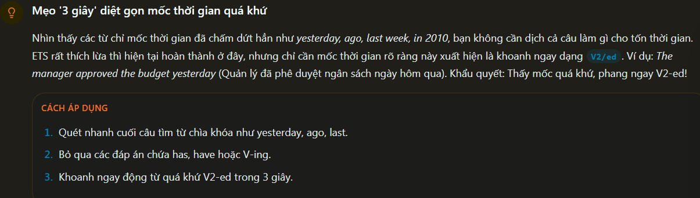
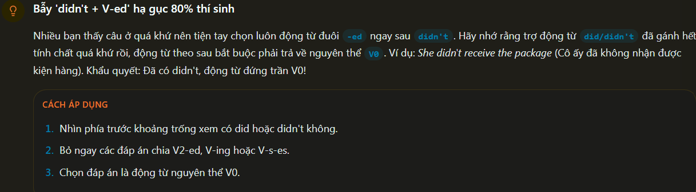
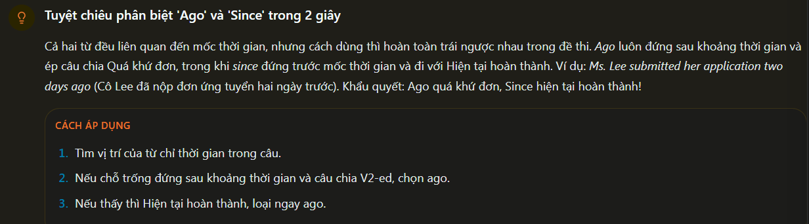
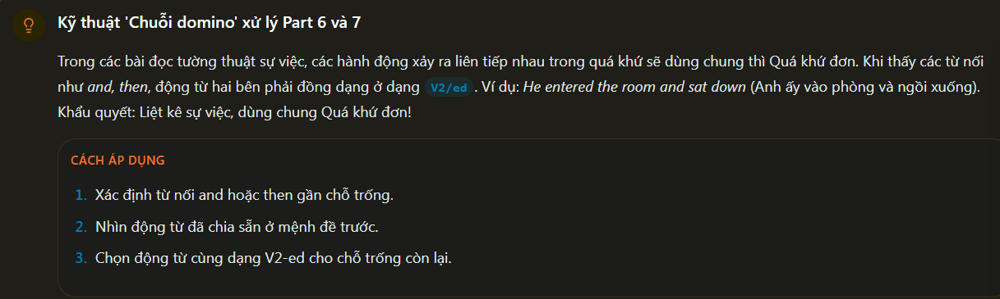
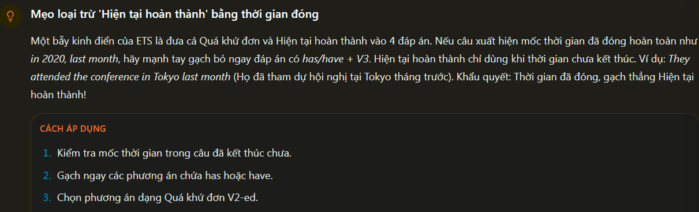
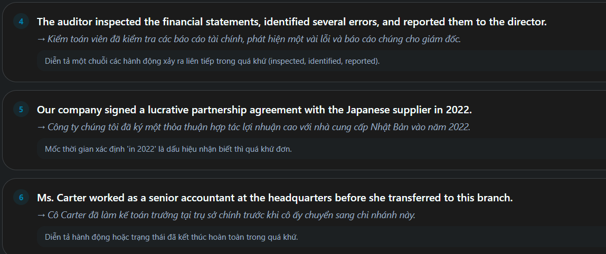

definition of the past simple:
 - Thì quá khứ đơn dùng để diễn tả một hành động đảy xảy ra và kết thúc hoàn toàn trong quá khứ tại 1 thời điểm xác định.

Fomula of the past simple:

how to use:
 - Hành động đã xong: Diễn tả hành động xảy ra và kết thúc hẳn trong quá khứ.
 - Chuỗi hành động: Diễn tả các hành động xảy ra liên tiếp trong quá khứ.
 - thói quen quá khứ: Diễn tả thói quen hoặc trạng thái đã chấm dứt trong quá khứ.

Past simple - Identification Signs:
 - keyworks: Yesterday, ago, last week, last month, in2020
 - Position: thường đứng ở đầu câu hoặc cuối câu để bổ nghĩa thời gian cho hành động

Errors Common:
 - Wrong: She didn't went to the meeting => correct: She didn't go to the meeting.
 - Wrong: I have received your email yesterday => Correct: i received your email yesterday.

Tip/Trick:
 - Thấy mốc thời gian quá khứ xác định (yesterday, ago, last,...) chọn ngay động từ v2/ed
 - Thấy did/didn't trong câu => chọn động từ nguyên mẫu V0

 - Mẹo '3second' mốc quá khứ
 

 - Bấy 'didn't + V-ed' 
 

 - Phân biệt 'Ago' và 'Since' 
 

 - Kỹ thuật "chuổi Domino"
 

 - Mẹo loại trừ 'hiện tại hoàn thành'
 

Example:

