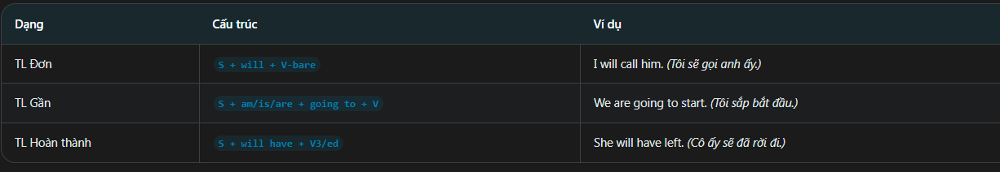
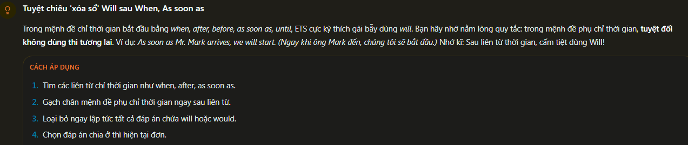
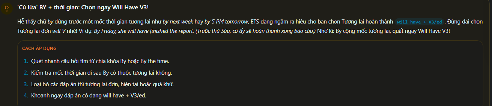
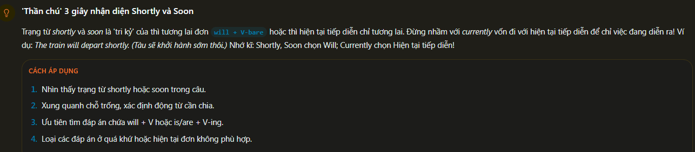
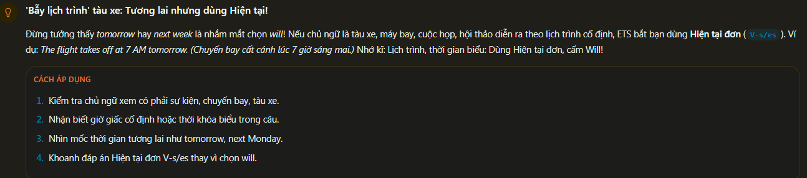
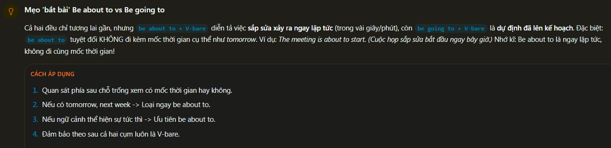
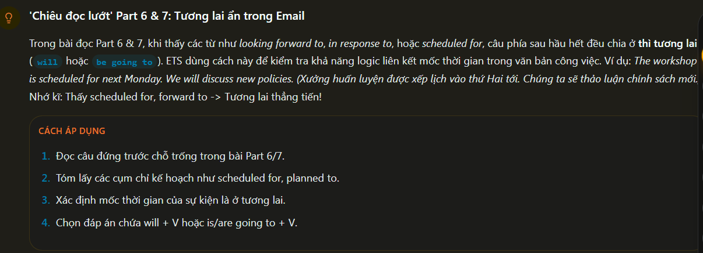
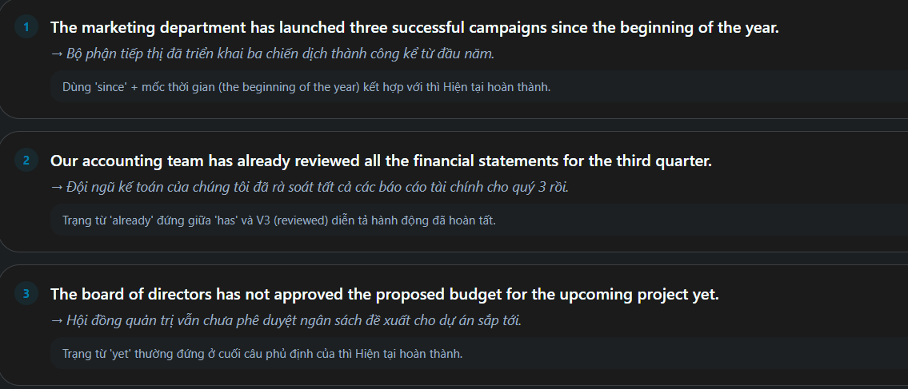
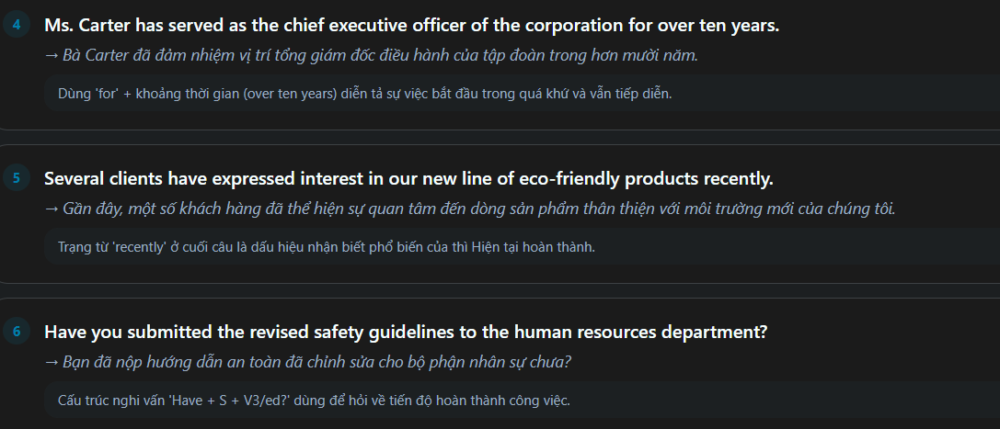

Simple future: 
the simple furture is used to describe actions or even that will happen in the future

Fomula-simple future:

How to use Simple future:
 - Bốc phát: Quyết định đưa ra ngay tại thời điểm nói  hoặc đưa ra dự đoán cá nhân   EX: I will check the report now.
 - kế hoạch: Dự định hoặc kế hoạch đã được sắp xếp từ trước thời điểm nói    EX:  We are going to sign the contract tomorrow.
 - Hoàn tất: hành động sẽ được hoàn thành trước một mốc thời gian xác định trong tương lai.   EX: By friday, he will completed the project.

Identifications sign:
 - Keywords: tomorrow, next week, soon, shortly, by next month ...
 - Position: thường đứng ở đầu câu hoặc cuối câu để chỉ thời gian tương lai

Errors Common:
 - Wrong: By next monday, i will finish the Task. => Correct: By next month, i will finished the task.
 - Wrong: After he will arrive, we will start. => Correct: After he arrives, we will start.

Tip/Trick:
 - Thấy Shortly hoặc soon => chọn will + V-bare
 - Thấy mệnh đề bắt đầu bằng when/after/as soon as => không chọn tương lai, chọn thì hiện tại đơn.

- Xoá "will" sau when và as soon as

- Lừa "by + thời gian": chọn ngay will have + V3

- 3second nhận diện shortly và soon

- Bẫy lịch trình: tương lai nhưng dùng hiện tại

- Mẹo be About to vs be going to

- Đọc lướt part 6&7: tương lai ẩn trong email

EXAMPLE:

